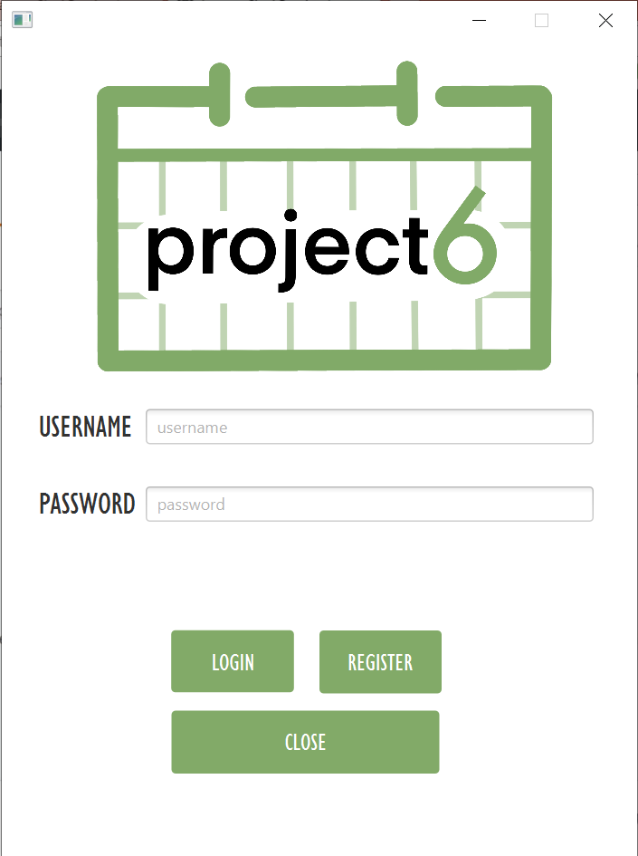
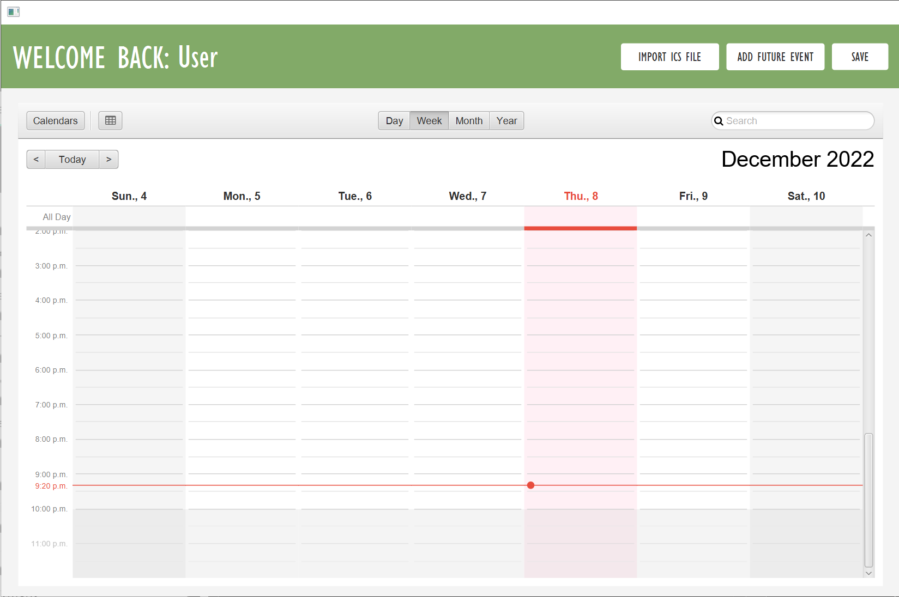
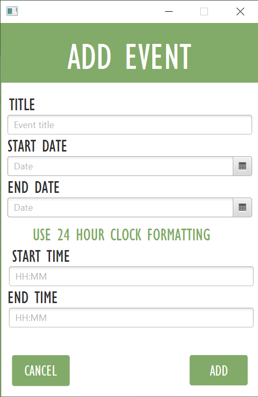
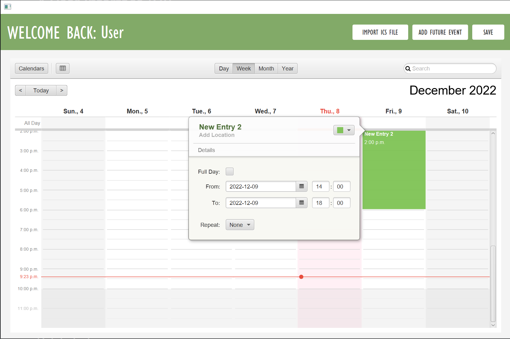
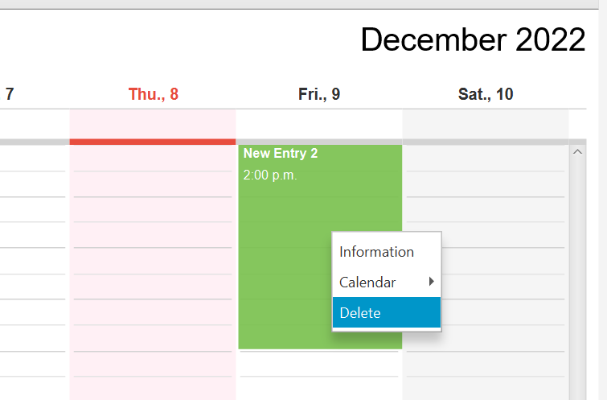
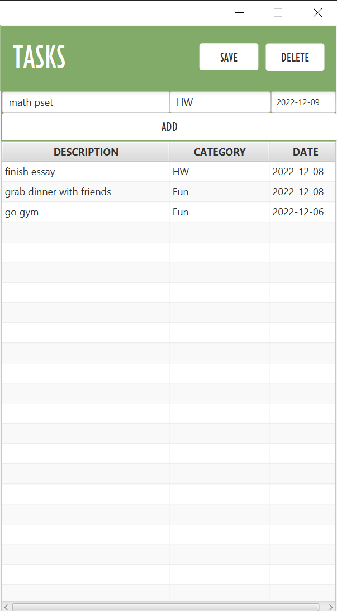
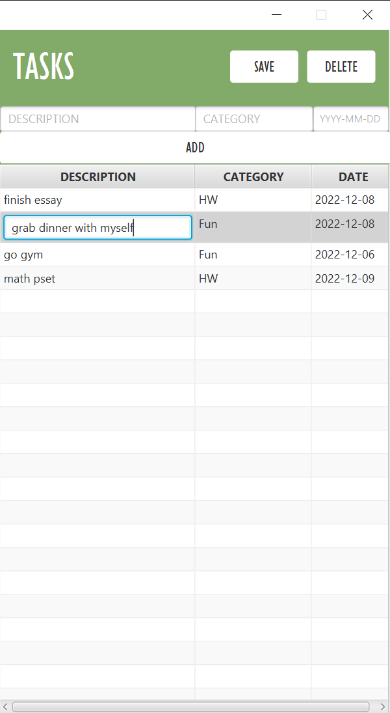

# Schedule 6

SSchedule 6 is a timetable, and task manager application. Users are able to import their calendars, add, edit, and delete events on the timetable. The To-do list enables users to create, edit, and delete tasks.

Students can use this application to enter class schedules, events, and assignments in order to keep track of their tasks. With this program, students are able to access all of their calendar events and tasks from one place and across multiple devices.

# Requirements for running 
To run our project, run `Main` in `src/main/java/main`

# Group members
- Nizar Abdouss([@nizarabdouss](https://github.com/nizarabdouss))
- Steven Li([@stevenli-uoft](https://github.com/stevenli-uoft))
- Selena Wang([@slnwang](https://github.com/slnwang))
- Tammy Wang([@TammyZhuoWang](https://github.com/TammyZhuoWang))
- Mike Wang([@mikewzh418](https://github.com/mikewzh418))
- Tristen White([@Tristenwhite](https://github.com/Tristenwhite))
- Brian Xue([@Bri-xX](https://github.com/Bri-xX))

# Project installation
## Mac User Font Download
Mac users need to download a font in order for the program to display properly. To do so, download the [Gill Sans MT Condensed font](https://www.dafontfree.net/gill-sans-mt-condensed-regular/f64848.htm). To add the font into the system, open Font Book through spotlight search (command + space) and find the plus button to add a new font. This will pull up a Finder window where the downloaded font can be selected and opened. Gill Sans MT Condensed will appear in the “User” section of Font Book

# Running the project
To run our project run Main in src/main/java/main

# Database
## MongoDB
## Data structure
## Data storage
## Data access

# User Interface (UI)
## User registration

On the login page, a first time user would need to register an account by clicking on the registration button, which opens up the registration page.

## User login
After an account is created, the user can re-enter their username and password to login.

## Schedule

## Import schedule

## Add event

## Edit event

## Delete event

## To-do list

## Add task

## Edit task

## Delete task

