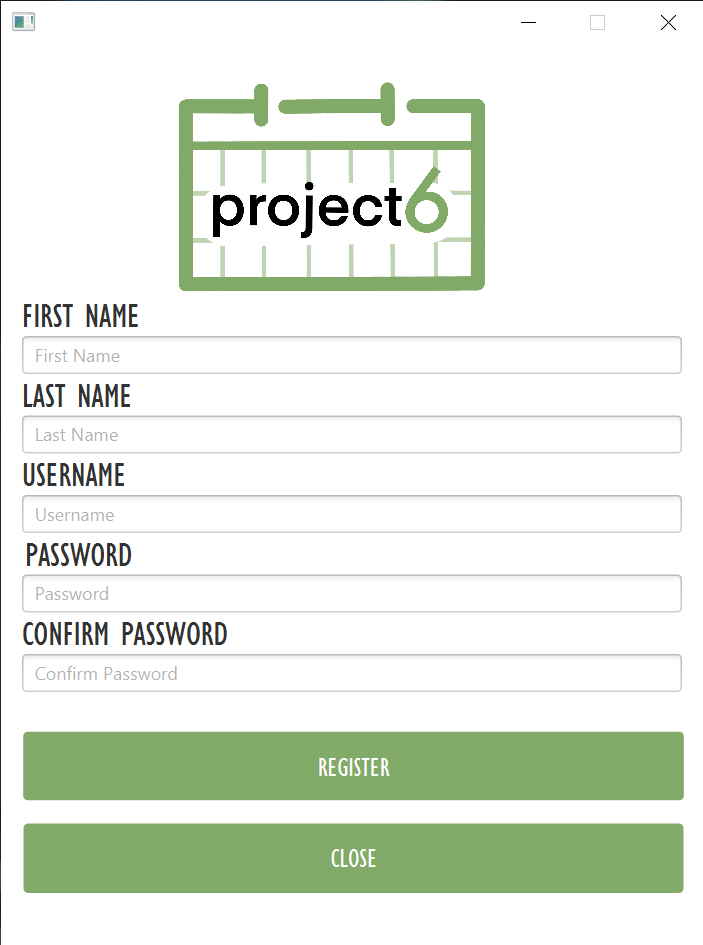

# Schedule 6

Schedule 6 is a schedule, and task manager application. Users are able to import their calendars and add events in the schedule manager. Task manager enables users to create, edit, and delete tasks.

Students can use this application to enter class schedules, events, and assignments in order to keep track of their tasks. With this program students are able to access all of their calendar events and tasks from one place.

# Requirements for running 
Selena write here 
# Group members
- Nizar Abdouss([@nizarabdouss](https://github.com/nizarabdouss))
- Steven Li([@stevenli-uoft](https://github.com/stevenli-uoft))
- Selena Wang([@slnwang](https://github.com/slnwang))
- Tammy Wang([@TammyZhuoWang](https://github.com/TammyZhuoWang))
- Mike Wang([@mikewzh418](https://github.com/mikewzh418))
- Tristen White([@Tristenwhite](https://github.com/Tristenwhite))
- Brian Xue([@Bri-xX](https://github.com/Bri-xX))

# 1 Entities 

## Entities.User
The User entity stores information about individual schedule 6 users.
### Attributes
* `userName`
* `password`
## Entities.Entry
The Entry entity stores information on each individual event created by the User.
### Attributes
* `title`
* `StartDate`
* `EndDate`
* `startTime`
* `endTime`
## Entities.Task
The Task entity stores information on each individual task created by the User.
### Attributes
* `description`
* `date`
* `category`

# 2 Usecases
## Event 
### Functions
* `create()`
    * Creates an instance of Event 
* `loadEvents()`
    * Fetches & Loads existing events in the DataBase
## Import
### Functions
* `create()`
    * Creates events based on the imported Ics file
## Task 
### Functions
* `create()`
* `loadTasks()`
## User
### Functions
* `loginCheck()`
* `create()`

# 3 Database
## MongoDB
## Data structure
## Data storage
## Data access

# 4 User Interface (UI)
## User login

## User registration

## Schedule

## Import schedule

## Add event

## Edit event

## Delete event

## To-do list

## Add task

## Edit task

## Delete task

# 5 Project installation
## Mac User Font Download
Mac users need to download a font in order for the program to display properly. To do so, download the [Gill Sans MT Condensed font](https://www.dafontfree.net/gill-sans-mt-condensed-regular/f64848.htm). To add the font into the system, open Font Book through spotlight search (command + space) and find the plus button to add a new font. This will pull up a Finder window where the downloaded font can be selected and opened. Gill Sans MT Condensed will appear in the “User” section of Font Book

# 6 Running the project
